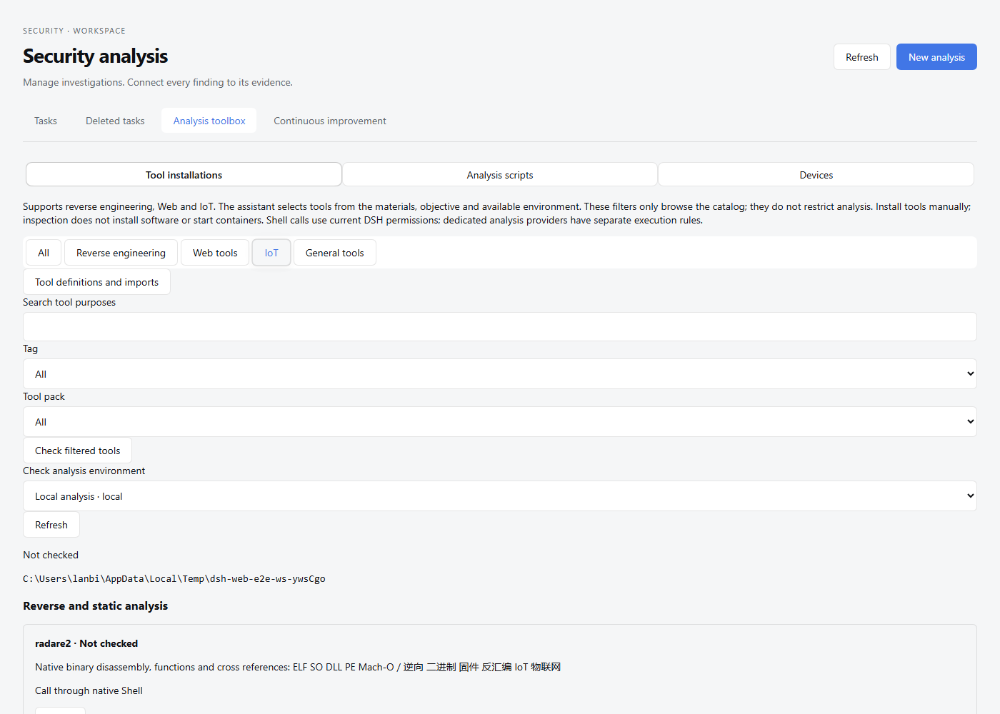
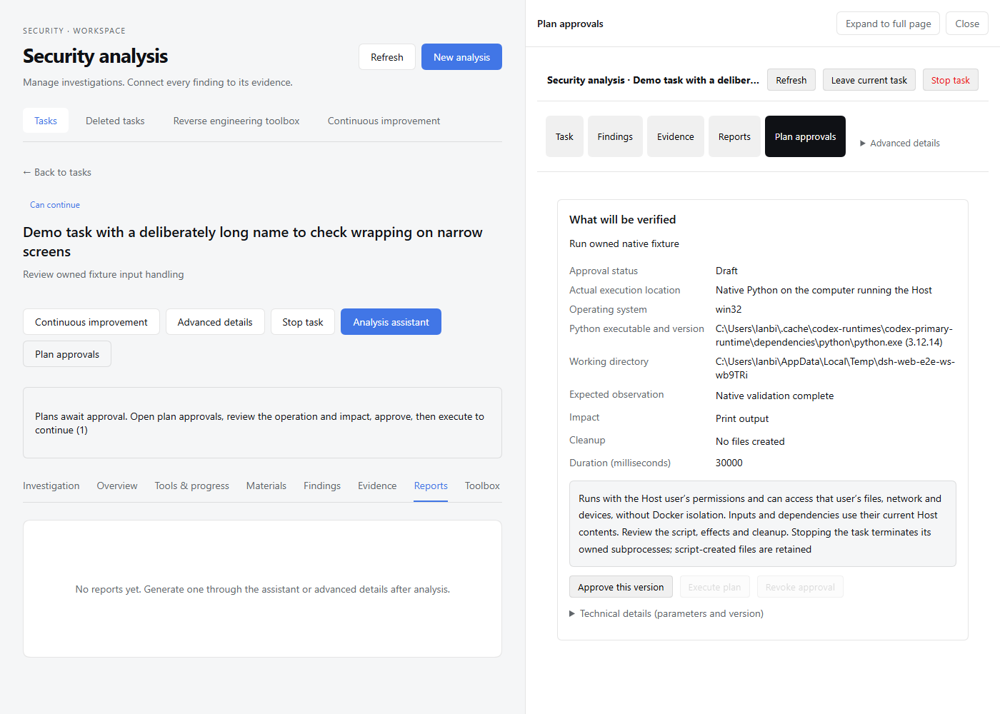

# Intelligent Security Analysis Workbench

English | [中文](README.zh.md)

**An intelligent security analysis workbench built on DeepSeek Harness (DSH).**

This project brings source code, binaries, firmware, Android applications and packet captures into a shared investigation workspace. Agents select methods around the research question, collect evidence, delegate focused tasks and produce reviewable findings and reports. The workbench connects materials, questions, observations and conclusions so analysts can inspect the basis of a result and direct the next step.

This repository builds on [DeepSeek Harness](https://github.com/deepseek-ai/deepseek-harness), the open-source agent harness developed by DeepSeek AI. DSH and Cordis provide plugin composition, model access, Sessions, tools and task execution; this project adds the security domain, investigation methods, execution controls and workbench interface.

[Security architecture](docs/security-architecture.md) · [User guide](docs/user/guide/security-analysis.md) · [Capabilities and limitations](packages/experimental/security-analysis/README.md) · [Roadmap](docs/roadmaps/security-analysis.md)

> [!IMPORTANT]
>
> The security extension is experimental. Tool availability and validation coverage vary by environment. A successful tool call or a generated report does not establish a vulnerability; findings must retain their evidence, review basis and uncertainty.

## Interface preview

These screenshots show the workbench in a development environment with demonstration data. They illustrate the interface, not a completed vulnerability assessment; the captured interface is in English.

### Analysis toolbox

Browse reverse engineering, Web and IoT capabilities, select an environment and inspect configured tools.



### Validation plan approval

Inspect the execution location, expected observation, impact and cleanup before approving a specific plan version.



## What makes this workbench different

- **Analysis driven by questions and evidence.** Combine reverse engineering, Web and IoT methods according to the material and the uncertainty to resolve. Reconnaissance, attack-surface analysis, assessment and validation describe individual checks; they do not impose a fixed sequence on every investigation.
- **Focused collaboration with independent review.** A coordinator delegates bounded questions to reconnaissance, reverse-analysis, Web-analysis, research or review roles when useful. Child Sessions return evidence references, conclusions and uncertainty; an independent review checks the exact finding before it can be confirmed.
- **An inspectable investigation chain.** Connect materials, checks, delegated tasks, observations, findings, validation plans and reviews in the workbench. Immutable artifacts and target identities support evidence inspection; revision-specific reports and evidence exports preserve the basis of a delivery.
- **Controlled runtime validation.** Dedicated validation providers execute immutable plans approved by the operator, with a fixed target, script, expected observation, limits and cleanup. Native analysis scripts use existing DSH permissions; they are a separate execution path. Stopping a project cancels its tracked work, and interrupted validation is not automatically replayed.
- **Tools and environments in one workspace.** Discover configured capabilities, inspect installations and manage tool definitions for local, Docker and Android environments. Reuse method skills and analysis scripts while keeping tool installation, target readiness and execution authorization distinct.
- **Experience and improvement grounded in actual work.** Retain reusable knowledge for operator review and publication. Turn observed workflow problems into improvement proposals and exportable implementation tasks, with human confirmation of verification; the workbench does not automatically launch a coding agent.

## Analysis scenarios

The workbench combines methods across materials. Each scenario depends on the configured tools and available targets; the [provider reference](packages/experimental/security-analysis/README.md#configure-analysis-providers) describes the supported operations and their verification limits.

| Scenario | Materials and analysis |
|---|---|
| Reverse engineering and Android | Binary identity, strings and byte inspection; configured Ghidra, JADX and Frida integrations for static analysis or approved runtime observation. |
| Web security | Source inspection, captured HTTP evidence and explicitly registered targets; reviewed findings and controlled HTTP or offline validation. |
| Firmware and IoT | Firmware components, embedded Web code and offline packet captures; combine binary, source, MQTT, Wi-Fi and BLE analysis as the evidence permits. Offline observations do not establish device behavior. |

## Architecture: DSH foundation, security domain, workbench

Security capabilities are composed as plugins and profiles around the existing DSH agent loop. The [security architecture](docs/security-architecture.md) explains the data flow and extension points; package references own the detailed behavior.

| Layer | Responsibility |
|---|---|
| DSH and Cordis foundation | Model access, Session logs, tools, jobs, subprocess supervision, storage and Host/Client communication. |
| Security domain and methods | Project and asset identities, checks, evidence, role-scoped delegation, provider execution, approvals, review, reports and reusable knowledge. |
| Analysis workbench | Task intake, chat, investigation chains, tool and environment management, progress, evidence inspection and report delivery. |

Session logs retain model interactions and tool results. A separate project journal retains domain state, while immutable artifacts retain imported materials and collected evidence. These records let an analyst revisit the investigation without treating chat history as the entire project.

## Run

Use the security-extension checkout of this repository. Follow the [development guide](docs/development.md) to install the declared Node.js and pnpm versions, install dependencies and build the workspace. The [security guide](docs/user/guide/security-analysis.md) covers model credentials and external tool setup; agent analysis requires a configured model, and external tools must be installed separately.

### Run from source

From the built repository root, start the security profile:

```sh
pnpm security --no-open
```

Open the authenticated URL printed by the launcher; the security profile defaults to port `3081`. In **Security Analysis**, create an analysis task, select its workspace and materials, and describe the question to investigate. Inspect progress and evidence in the workbench, review any validation plan before approval, and read or export the resulting report.

The source launcher loads built workspace plugins. Rebuild after changing Host or Client code before restarting. The upstream `@deepseek-ai/dsh` npm package and generic Web profile provide the DSH foundation; use this checkout's security profile for the workbench described here.

## Current limits

The project and its DSH foundation are in developer preview, with compatibility-breaking changes possible. Review the [safety notice](SAFETY.md) before use and analyze only materials and targets within your authorization.

External tool support is environment-specific: Ghidra needs a prepared integration, Android runtime observation needs a ready device, and a tool listed in the toolbox may offer discovery without a dedicated execution provider. Static, simulated and runtime observations have different evidentiary value. The [known limitations](packages/experimental/security-analysis/README.md#known-limitations-and-deferred-work) and [roadmap](docs/roadmaps/security-analysis.md) record detailed gaps and remaining acceptance work.

## Documentation and development

- [Security user guide](docs/user/guide/security-analysis.md): task intake, tools, evidence, reports and environments.
- [Security architecture](docs/security-architecture.md) and [domain reference](docs/subsystems/security-workbench.md): composition, permissions and persistent project records.
- [Development guide](docs/development.md) and [DSH architecture](docs/architecture.md): source development and foundation services.
- [Contributing](CONTRIBUTING.md) and [AGENTS.md](AGENTS.md): repository contribution and agent instructions.

## Upstream and acknowledgements

DeepSeek AI develops the upstream [DeepSeek Harness](https://github.com/deepseek-ai/deepseek-harness). Its [documentation site](https://deepseek-harness.github.io/deepseek-harness/) describes the general-purpose foundation. Cordis supplies the plugin framework. PentAGI informs specialist delegation, research and concise reporting, as described in the [security design roadmap](docs/roadmaps/security-analysis.md).

The following citation is for the upstream DSH project:

```bibtex
@misc{deepseek-harness2026,
  title={DeepSeek Harness: Everything is a Plugin},
  author={DeepSeek-AI},
  year={2026},
  publisher={GitHub},
  howpublished={\url{https://github.com/deepseek-ai/deepseek-harness}},
}
```

## License

[MIT](LICENSE)

Third-party dependencies and their licenses are disclosed in [THIRD_PARTY_NOTICES.md](THIRD_PARTY_NOTICES.md).
