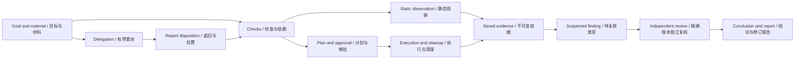

# Security workflow and capability audit

English | [中文](security-workflow-capability-audit.zh.md)

## Summary

This reference defines the second-batch workflow audit and third-batch capability audit after the investigation-chain interface. Maintainers can use each item to reproduce a gap, identify its owner, and decide whether a backend change is justified. The audit preserves the current evidence, approval, review and recovery mechanisms; it does not authorize replacing the scheduler or report proposed capabilities as delivered. The [implementation plan](security-harness-simplification.md) owns delivery order; the [package reference](../../packages/experimental/security-analysis/README.md) owns runtime behavior.

## Contents

- [Evidence and first-batch constraints](#evidence)
- [Second batch: workflow audit](#workflow)
- [Third batch: capability audit](#capabilities)
- [Real-tool acceptance](#tools)
- [Validation and audit exit](#validation)
- [Dev Note](#dev-note)

<a id="evidence"></a>
## Evidence and first-batch constraints

The source review distinguishes implemented behavior, existing tests and unexecuted experiments. Passing mocked-provider tests does not establish a real tool's compatibility or a model's analysis quality. The runs recorded below cover existing domain behavior; the additional scenarios remain acceptance work. No backend capability is implemented by this audit.

The first batch derives links from the [durable records](../../packages/experimental/security-analysis/src/workbench/model.ts): check dependencies, evidence-to-check or plan references, finding evidence, review support/opposition, delegation direction and retry references. A checkpoint groups a research direction; adjacent timestamps, a shared asset or a shared direction do not establish causality. Current finding state comes from the finding record, not a checkpoint's saved status. Titles, conclusions, progress and blockers belong in the reading path; hashes, raw evidence and execution parameters remain available in details.

Preserve the stronger existing controls in [the controller](../../packages/experimental/security-analysis/src/workbench/controller.ts): completing a check requires evidence and completed dependencies; a conclusive finding requires independent review of its exact content; restarting marks unsettled work interrupted and revokes approvals instead of replaying external actions. The [workbench tests](../../packages/experimental/security-analysis/tests/workbench.spec.ts) exercise missing evidence, changed findings, forged reviewers, stopped projects and interrupted executions.

The audit confirms two workflow capability gaps in the inspected code: no project-wide cumulative effort admission and no explicit delegation-to-check/input-evidence association. It did not reproduce a lifecycle defect in the selected tests. Neither gap justifies rewriting scheduling. The proposed ranking below is separate from implementation approval.

| Disposition | Recommended next action | Cost or reason to defer |
|---|---|---|
| Preserve | Keep evidence-bound completion, independent review, approval identity and non-replaying recovery. | Existing controls and regression tests already cover the central correctness obligations. |
| Investigate next | Reproduce check-linked delegation and cumulative effort using the second-batch scenarios. | Associations are a medium-sized domain change; durable cumulative reservations are larger and need measured policy choices. |
| Separate follow-up | Specify complete evidence export before finding retest; implement neither inside the reading-interface change. | Export has a clear portability gap and bounded scope. Retest adds target-version and remediation semantics. |
| Derive from existing records | Add question/check coverage only where it clarifies the investigation chain. | Low-to-medium projection work; defer any numerical security score. |
| Defer | Add explicit historical-project references only after existing knowledge and Session lookup fail a concrete case. | Retrieval overlap, stale conclusions and project isolation require evidence of demand. |

<a id="workflow"></a>
## Second batch: workflow audit

Audit one scoped investigation containing independent checks, a dependent check, a fresh worker and an independent reviewer. Repeat the relevant transitions under cancellation and restart. Classify each outcome as a confirmed defect, a capability gap, a presentation gap or an unverified hypothesis before proposing changes.



The delegation return is a coordinator action, not an existing durable check association. Failed and incomplete output remains observational; stopping, reopening and restart are covered below.

### Aggregate effort and finalization

- **Evidence:** [analysis-budget.ts](../../packages/experimental/security-analysis/src/analysis-budget.ts) counts usage per Session turn and admits one final response; it clears accounting at turn boundaries. [Delegation admission](../../packages/experimental/security-analysis/src/index.ts) reserves concurrent worker capacity and gives each worker a deadline. These are distinct from a project-wide cumulative allowance.
- **Reproduce:** run two coordinator turns with two workers; compare all logged usage with the displayed allowance and observe the per-turn reset. Include a worker that reaches its limit while holding a partial report. Record whether any configured admission limit accounts for the complete project.
- **Expected:** retained and in-flight effort is visible without confusing it with billing. If a cumulative policy is introduced, Host admission reserves capacity, terminal settlement reconciles it, and final evidence integration retains an explicit allowance. Its acceptance includes concurrent admissions near the limit, cancellation before child creation and restart after reservation. Budget exhaustion does not mean investigation completion; cancellation waits for owned resources. Measure the cost before selecting default limits.
- **Owner and acceptance:** security accounting and delegation, using existing Session usage and jobs. The [Loader tests](../../packages/experimental/security-analysis/tests/workbench-loader.spec.ts) cover wrap-up, structured reports, concurrent capacity reservation and distinct timeout facts; cumulative accounting and restart reservations need additional scenarios. Do not add a second execution engine.

### Check-linked delegation and useful progress

- **Evidence:** [check records](../../packages/experimental/security-analysis/src/workbench/model.ts) contain dependencies and evidence. Delegations contain a direction, question, criterion, retry reference and result disposition, but no explicit check or input-evidence list. `admitDelegation` validates project/asset scope and a settled retry; check execution separately validates dependencies.
- **Reproduce:** create two dependent checks and one independent check, then delegate the dependent question before its prerequisite finishes. Submit the same question in a new call after a completed report, and request an independent review that only repeats its summary. Inspect which relationship and missing observation the journal can actually express.
- **Expected:** determine whether explicit check/input references are needed before adding fields. A proposed association must reject missing or foreign records before creating a worker and preserve independent work when another check is blocked. Coordinator disposition states what a report resolves; another summary, model agreement or new timestamp is not new target evidence. Keep bounded direct delegation available when no check association is needed.
- **Owner and acceptance:** security delegation, check admission and role guidance. Existing [domain tests](../../packages/experimental/security-analysis/tests/workbench.spec.ts) cover captured scope, foreign evidence, coordinator disposition and recovery; [Loader tests](../../packages/experimental/security-analysis/tests/workbench-loader.spec.ts) cover call-id idempotency and fresh retry. Add unmet-dependency, obsolete-input and repeated-work scenarios only with the chosen policy.

### Interruption, continuation and stale work

- **Evidence:** `settleDelegation`, `recover` and `cancelExecutions` in [the controller](../../packages/experimental/security-analysis/src/workbench/controller.ts) preserve terminal records and await cleanup. Workers are one-shot; `retryOf` creates another fresh worker. `reopen` invalidates dependent checks and approved plans, while changed finding content requires another review.
- **Reproduce:** cancel one worker while an independent worker continues; stop a project during evidence publication; reopen an upstream check; change a finding while its review runs; restart with a running validation. Reconnect the UI and inspect the same saved state.
- **Expected:** the operator can distinguish cancelled, timed-out, failed and interrupted work and reach retained observations. A follow-up is labelled as new work, not restoration of an old worker. Incompatible work is cancelled or reconciled before reuse; external side effects are never replayed merely to recover a screen. Confirm a missing control entry before changing lifecycle semantics.
- **Owner and acceptance:** controller, existing jobs and workbench controls. Preserve the cleanup, interrupted-execution, historical-report and stale-review cases in the [domain tests](../../packages/experimental/security-analysis/tests/workbench.spec.ts); add a real profile/browser case for any new user control.

<a id="capabilities"></a>
## Third batch: capability audit

These candidates extend investigation outcomes rather than tool count. Each requires a demonstrated user scenario; record cost and overlap with existing DSH services before accepting an implementation.

The matrix traces current entry points through delivery. Classifications can coexist: “complete” applies only to the stated, accepted path; external devices or tools without a real run remain “real acceptance missing.” Implementation evidence is in the [workbench reference](../../packages/experimental/security-analysis/README.md) and the tool verification entries below.

| Capability | User entry → model/tool → execution → persistence → viewing or delivery | Classification and gap |
|---|---|---|
| Material import | New analysis/materials → import command → file, directory or text import → immutable material and identity → materials, graph | Complete: this run imported local source and saved observations through the real model; existing validation owns large directories and malformed formats. |
| Source analysis | Materials/assistant → source read/search → immutable source read → locations and raw output → graph inspector, report | Complete: the real model completed a static invoices.js investigation; runtime reachability remains unverified. |
| Binary analysis | Materials/reverse toolbox → binary, Ghidra, Frida → parsing, decompilation or approved instrumentation → raw evidence → findings/report | Partial implementation, real acceptance missing: distinguish parsing from external reverse-engineering tools; see the tool matrix. |
| Web analysis | URL material/laboratory/assistant → scoped HTTP and validation plan → scoped requests or isolated environment → request results and simulation labels → evidence/report | Partial implementation, real acceptance missing: this audit did not execute the real Docker/HTTP matrix. |
| Capture analysis | Analyze action on material → packet-capture/script library → bounded TShark decoding → frame references, versions and completeness → output preview | Partial implementation, real acceptance missing: offline decoding exists; interface inventory does not establish live capture support. |
| Tools and environments | Reverse toolbox → capabilities/environment → catalog lookup, version probes, providers → environment/tool inventory → tool cards | Inconvenient entry: the catalog is broader than directly executable dedicated providers; installation does not establish a complete analysis path. |
| Validation and review | Plan approvals/assistant → plan, independent reviewer → bounded execution and exact-content review → plan, evidence, review → current finding and historical reports | Complete: domain tests and real-profile browser approval passed; external providers were not individually exercised in this run. |
| Knowledge and history | Continuous improvement/assistant → knowledge refinement, lookup → user-reviewed sharing → knowledge records → subsequent investigation reference | Inconvenient entry; explicit versioned historical-project references are missing. Knowledge is not current-target evidence. |
| Result delivery | Reports → report → snapshot generation → revised Markdown/JSON → workbench reading | Partial implementation: reports exist; a portable export containing all original evidence is missing. |
| Android | APK/DEX materials, devices → JADX/adb/Android methods → parsing or selected-device queries → child materials, device identity and observations → evidence/findings | Partial implementation, real acceptance missing: no device was exercised in this run; APK parsing is not complete dynamic analysis. |
| Firmware and IoT | Binary/capture materials, methods → firmware/iot-offline/MQTT guidance → extraction, static analysis or offline simulation → components and simulated observations → findings/report | Partial implementation, real acceptance missing: no real-device execution or end-to-end firmware acceptance in this run; simulation does not establish hardware behavior. |

Candidate priority is complete evidence export, check-coverage projection, remediation/retest history, then explicit historical-project references. The following items specify triggers, ownership and acceptance without counting candidates as implemented.

| Candidate and evidence | Reproducible need | Expected result and acceptance | Owner and tradeoff |
|---|---|---|---|
| Finding retest: [finding state](../../packages/experimental/security-analysis/src/workbench/model.ts) describes claim validity; [reopen and revise-finding](../../packages/experimental/security-analysis/src/workbench/controller.ts) do not store a separate remediation history. | Confirm a finding, import a corrected version, and attempt to record whether the same condition remains without replacing the original evidence. | An explicit retest links the old finding content, new asset identity, checks and observations. Failed, cancelled or inconclusive runs cannot mean fixed. New target identity needs its own applicable approval and review. Test repeated submission, stale review, restart and retained old evidence. | Security domain. Keep remediation separate from `confirmed/refuted`; start with linked checks and retest history before adding ownership, notifications or SLAs. |
| Complete evidence export: [report generation](../../packages/experimental/security-analysis/src/workbench/controller.ts) saves a revisioned JSON snapshot; [report/artifact Remote methods](../../packages/experimental/security-analysis/src/index.ts) expose text reports and bounded previews. | Export a report containing binary or larger-than-preview evidence, move it away from the original Host, and try to verify every cited observation. | A candidate package includes the selected report snapshot, referenced metadata and original evidence bytes with a digest/length manifest. Build the reference set from that snapshot; explicitly reject missing/corrupt content. Test binary data, concurrent new reports, limits, cancellation and independent verification. | Security report/export path over the existing artifact store. Explicit operator action and configurable size bounds; do not include all imported samples by default or create another store. |
| Historical investigation reuse: [sharedKnowledge](../../packages/experimental/security-analysis/src/workbench/controller.ts) and [knowledge refinement](../../packages/experimental/security-analysis/src/workbench/knowledge.ts) already provide reviewed reusable lessons. | Investigate the next version of a component and need the exact earlier report and observation, rather than only a general lesson. | First test whether existing knowledge and Session lookup suffice. If a project reference is needed, select its source/version explicitly and expose bounded read-only material. It remains a lead, not current-target evidence or execution authority. Test revoked/deleted sources, indirect references, changed samples and logged model context. | Security references using existing search. Avoid default cross-project retrieval and duplicate memory services; retain project isolation. |
| Coverage of the requested questions: [check criteria](../../packages/experimental/security-analysis/src/workbench/model.ts) and [report coverage](../../packages/experimental/security-analysis/src/workbench/report.ts) already carry useful inputs. | Read one source file, complete an inventory check, and leave a required runtime observation blocked. Inspect whether the summary suggests the target is fully assessed. | Derive coverage from scoped questions, checks and evidence: unexamined, observed, statically supported, runtime-validated or blocked. Keep unknown scope visible. Test zero findings, partial reads, missing dependencies, failed observations and stale reviews. Do not turn file/tool counts into a safety percentage. | Workbench/report projection; reuse the journal. The [report tests](../../packages/experimental/security-analysis/tests/report.spec.ts) cover source coverage, missing coverage and accepted current reviews. A graph database is unnecessary for this decision. |

<a id="tools"></a>
## Real-tool acceptance

The package's [compatibility and limitation sections](../../packages/experimental/security-analysis/README.md) own supported behavior. This matrix defines the remaining verification work. For each run retain tool/runtime versions, target identity, environment, entry path, raw results and cleanup observations; classify it as passed, failed, skipped or not run. Installation, a version probe, a simulated provider and a real model statement are separate evidence classes.

| Tool path | Existing verification entry | Required real observation or remaining gap |
|---|---|---|
| Source and binary observations | [source tests](../../packages/experimental/security-analysis/tests/source.spec.ts), [binary tests](../../packages/experimental/security-analysis/tests/binary.spec.ts) | Immutable bytes and locations survive live-file changes; compare PE/ELF observations with an independent parser. Inventory does not establish a vulnerability. Record unsupported format/architecture and partial output. |
| Native Python | [native provider tests](../../packages/experimental/security-analysis/tests/native-provider.spec.ts), native-Python case in [Loader tests](../../packages/experimental/security-analysis/tests/workbench-loader.spec.ts) | Use the configured Host interpreter on an owned fixture. Verify pinned interpreter/version, approval, saved output, cancellation and owned process cleanup. A Windows DLL additionally needs matching Host/Python architecture; offline Linux success cannot substitute. |
| Ghidra | [Ghidra tests](../../packages/experimental/security-analysis/tests/ghidra-workbench.spec.ts) | The tests simulate HTTP. Operator-prepared Ghidra and its managed extension must complete import/binding, function search, decompilation and cross-references through DSH. Switch the loaded program, close the GUI and cancel a query; retain identity rejection and cleanup evidence. |
| Frida | [real Frida fixture](../../packages/experimental/security-analysis/tests/frida-workbench.e2e.ts) | Requires `DSH_SECURITY_FRIDA_PYTHON` and `DSH_SECURITY_FRIDA_TARGET`; the fixture exercises duration and cancellation on its owned target. Separately verify detach, target exit, identity change, output flood and incomplete cleanup on each claimed platform. |
| Android, adb and JADX | [APK tests](../../packages/experimental/security-analysis/tests/apk.spec.ts), [device tests](../../packages/experimental/security-analysis/tests/device-inventory.spec.ts), [Android provider](../../packages/experimental/security-analysis/src/android-provider.ts) | Package parsing and inventory are not device acceptance. Use an authorized device/emulator, match its identity, trace Manifest to Java/Kotlin and JNI, and exercise disconnect, incompatible versions and incomplete decompilation. No available device means this row stays unverified. |
| Docker environment and scoped HTTP | [environment fixture](../../packages/experimental/security-analysis/tests/environment-workbench.e2e.ts), [laboratory fixture](../../packages/experimental/security-analysis/tests/laboratory-workbench.e2e.ts), [Web tests](../../packages/experimental/security-analysis/tests/web.spec.ts) | Real fixtures require `DSH_SECURITY_DOCKER_IMAGE`; laboratory execution also needs its recipe dependencies. Verify owned resource labels, pinned images, isolated network, out-of-scope rejection, reset identity and cleanup. Reused images do not validate a new image build. |
| Offline Python and browser | [offline fixture](../../packages/experimental/security-analysis/tests/offline-workbench.e2e.ts) | Requires `DSH_SECURITY_OFFLINE_IMAGE`. Exercise both runtimes with immutable source, network denial, failure and cleanup. Label output as simulation; do not infer hardware behavior or native Windows support. |
| Offline Wi-Fi/BLE capture | [capture tests](../../packages/experimental/security-analysis/tests/packet-capture.spec.ts), capture cases in [Loader tests](../../packages/experimental/security-analysis/tests/workbench-loader.spec.ts) | Provider tests mock decoding. Real Loader cases require `DSH_SECURITY_TSHARK` and the configured Python. Verify PCAP/PCAPNG identity, protocol/frame references, limits and malformed input. Driver/interface discovery does not authorize or validate live capture. |
| Catalog tools, including Nuclei, Metasploit, John and fastboot | [tool definitions](../../packages/experimental/security-analysis/src/builtin-tools.ts), [catalog tests](../../packages/experimental/security-analysis/tests/tool-catalog.spec.ts), [tool/environment roadmap](security-analysis.md#tool-and-environment-expansion) | Separate directory entries, measured versions, native Shell guidance and dedicated provider support. Accept each claimed operation through its actual DSH path with fixed inputs, effects, output capture and cleanup. A tool installation or one successful command does not validate all modules or templates. |

<a id="validation"></a>
## Validation and audit exit

The current audit ran these existing tests in the checked-out Windows workspace. They establish the listed domain baseline; they do not implement or certify the proposed additions and do not exercise the external real-tool matrix.

```sh
pnpm exec vitest run packages/experimental/security-analysis/tests/workbench.spec.ts packages/experimental/security-analysis/tests/report.spec.ts
pnpm exec vitest run packages/experimental/security-analysis/tests/workbench-loader.spec.ts -t 'wrap-up|worker capacity|saved assignments|worker creation|worker deadline|assignment|structured report|scoped child evidence'
```

Observed results: the first command passed 84 tests in two files; the second passed seven selected tests and skipped 79 unselected tests in one file. Preserve skipped/not-run distinctions when repeating the matrix. The [testing policy](../testing.md) owns profile, recorded-session and real-environment requirements.

The second batch exits with reproducible findings, retained existing controls, rejected hypotheses and separately scoped change proposals. The third exits with an accepted/deferred decision per capability and an environment-specific verification ledger. Every accepted proposal names its minimal owner, data compatibility impact, user-visible failure/recovery behavior and positive/negative acceptance cases. Measure quality, duplicate work, total effort and intervention count under the same inputs/model/budget before claiming improvement. Provider execution, lifecycle changes and new stored fields require their own implementation and validation; this document does not mark them complete.

<a id="dev-note"></a>
## Dev Note

This section is non-authoritative. Beyond the recorded regression runs, no additional runtime experiments, environment installation or backend changes are included in the audit. The first unresolved validation action is the two-turn/two-worker effort comparison and check-linked delegation reproduction above, using recorded or scripted model inputs before a live-model comparison.
