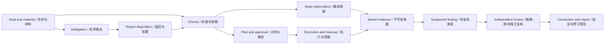

# 安全流程与功能审计

[English](security-workflow-capability-audit.md) | 中文

## 摘要

本文为调查链路界面之后的第二批流程审计和第三批功能审计提供参考。维护者可据此复现缺口、确定归属，再判断后端改动是否必要。审计保留当前证据、审批、复核与恢复机制，不授权重写调度器，也不将拟议能力记为已交付。[实施计划](security-harness-simplification.zh.md)维护交付顺序，[包参考](../../packages/experimental/security-analysis/README.zh.md)维护运行行为。

## 目录

- [证据与首批约束](#evidence)
- [第二批：流程审计](#workflow)
- [第三批：功能审计](#capabilities)
- [真实工具验收](#tools)
- [验证与审计完成条件](#validation)
- [开发备注](#dev-note)

<a id="evidence"></a>
## 证据与首批约束

源码核查区分已有实现、现有测试与尚未执行的实验。模拟 provider 测试通过不能证明真实工具兼容性或模型分析质量。检查关联委派、共享覆盖投影、受阻定位及完整证据包已有实现；下文保留其验收要求。累计投入、复测和历史项目引用仍是候选，不属于当前交付。

第一批从[持久记录](../../packages/experimental/security-analysis/src/workbench/model.ts)派生关联：检查依赖、证据对检查或计划的引用、发现引用的证据、复核的支持与反对关系、委派所属方向及重试引用。checkpoint 用于归组研究方向；时间相邻、同一资产或同一方向不构成因果关系。发现当前状态取自 finding 记录，而非 checkpoint 保存的状态。标题、结论、进度与阻塞进入主要阅读路径；哈希、原始证据和执行参数仍可在详情中查看。

保留[controller](../../packages/experimental/security-analysis/src/workbench/controller.ts)已有的严格控制：完成检查必须具备证据且依赖已完成；确定发现须有绑定精确内容的独立复核；重启将未结算工作标记为中断并撤销批准，不重放外部动作。[工作台测试](../../packages/experimental/security-analysis/tests/workbench.spec.ts)覆盖缺失证据、发现变更、伪造复核者、停止项目和中断执行。

项目累计投入尚未参与准入。委派已支持可选检查和输入依据关联；旧调用及记录缺省时保持直接委派。检查完成和发现确认继续使用原有显式操作，不由子任务摘要提升。以下为当前处置与后续建议。

| 处置 | 建议下一步 | 成本或延后原因 |
|---|---|---|
| 保留 | 保留证据约束的完成、独立复核、审批身份和不重放恢复。 | 既有控制及回归测试已经覆盖主要正确性要求。 |
| 已实现，持续验证 | 委派显式关联待检查项和同资产输入观察，准入与子任务绑定均校验依赖。 | 累计投入仍需实测后选择策略，不新增模型配置体系。 |
| 已实现，持续验证 | 从选定报告快照导出完整观察与计划脚本，附清单和校验文件。 | 复测仍延后；它增加目标版本和修复处置语义。 |
| 已实现，持续验证 | Host 共享检查覆盖投影供活动流和新报告使用；界面直接定位受阻检查。 | 不从文件或工具数量推断安全程度，不持久化派生结果。 |
| 延后 | 只有现有知识及 Session 查询无法满足具体案例时，才增加显式历史项目引用。 | 检索重叠、过期结论及项目隔离需要真实需求依据。 |

<a id="workflow"></a>
## 第二批：流程审计

选取一个范围明确的调查，包含独立检查、依赖检查、fresh worker 与独立复核者；在取消和重启条件下重复相关状态转换。提出改动前，将结果分类为确认缺陷、能力缺口、表现层缺口或尚未验证的假设。



图中的委派回收仍是协调者的后续动作。可选 `checkId` 和 `inputEvidenceIds` 保存明确关联，图仅为这些引用增加连线。失败和不完整输出保留为观察；停止、重开与重启的处理见下文。

### 累计投入与收尾

- **依据：**[analysis-budget.ts](../../packages/experimental/security-analysis/src/analysis-budget.ts)按 Session turn 计量并保留一次最终答复，在 turn 边界清空计量。[委派准入](../../packages/experimental/security-analysis/src/index.ts)预留并发 worker 容量，并为每个 worker 设置期限。这些控制不同于项目累计额度。
- **复现：**运行两个协调者 turn 和两个 worker，对比全部日志用量与展示的额度，观察每轮重置。包含持有部分报告时触及上限的 worker。记录现有哪项准入限额会计入整个项目。
- **期望：**已发生及在途投入可见，并与计费区分。若引入累计策略，Host 准入预留容量，终态结算核对用量，并为最终证据整合明确预留额度；其验收包含临界额度并发准入、创建子 agent 前取消，以及预留之后重启。预算耗尽不表示调查完成，取消须等待自有资源清理。选择默认限额前先测量开销。
- **归属与验收：**安全计量及委派，复用现有 Session usage 和 jobs。[Loader 测试](../../packages/experimental/security-analysis/tests/workbench-loader.spec.ts)覆盖收尾、结构化报告、并发容量预留及独立的超时事实；累计计量和重启预留需要新增场景。不另建执行引擎。

### 检查关联委派与有效进展

- **依据：**[检查和委派记录](../../packages/experimental/security-analysis/src/workbench/model.ts)保存可选检查及输入依据引用。`admitDelegation` 校验项目、资产、待检查状态、已完成依赖及原始依据身份；绑定子任务时再次校验检查状态和依赖。活动委派存在时，重开受影响检查须先取消并等待清理。
- **复现：**创建两个相互依赖的检查和一个独立检查，在前置检查完成前委派后续问题。收到已完成报告后用新调用再次提交相同问题，再请求只重述摘要的独立复核。核对 journal 实际能够表达哪些关联与缺失观察。
- **期望：**创建 worker 前拒绝缺失或外部记录；一项检查受阻不妨碍独立工作。协调者处置说明报告解决了什么；另一份摘要、模型赞同或新时间戳不构成新目标证据。无需检查关联时保留有界直接委派；重试显式提供本次输入。
- **归属与验收：**安全委派、检查准入及角色指导。[领域测试](../../packages/experimental/security-analysis/tests/workbench.spec.ts)覆盖固定范围、损坏依据、未完成依赖、排队状态变化、取消后重开及独立工作；[Loader 测试](../../packages/experimental/security-analysis/tests/workbench-loader.spec.ts)覆盖调用 ID 幂等、fresh 重试及记录到子任务的检查条件和输入引用。

### 中断、继续与过期工作

- **依据：**[controller](../../packages/experimental/security-analysis/src/workbench/controller.ts)中的 `settleDelegation`、`recover` 和 `cancelExecutions` 保留终态记录并等待清理。worker 为一次性执行，`retryOf` 创建另一个 fresh worker。`reopen` 使依赖检查和已批准计划失效，发现内容改变则要求重新复核。
- **复现：**取消一个 worker，让独立 worker 继续；证据发布期间停止项目；重开上游检查；复核期间修改发现；带运行中验证重启。重连 UI 后核对同一已保存状态。
- **期望：**操作者能区分取消、超时、失败和中断，并访问保留的观察。后续调查标为新工作，不冒充原 worker 恢复。不兼容工作经取消或核对后才能复用；不能仅为恢复界面而重放外部副作用。改变生命周期语义前，先确认是否只是缺少控制入口。
- **归属与验收：**controller、现有 jobs 与工作台控制。保留[领域测试](../../packages/experimental/security-analysis/tests/workbench.spec.ts)中的清理、中断执行、历史报告和过期复核用例；任何新用户控制都补充真实 profile/浏览器场景。

<a id="capabilities"></a>
## 第三批：功能审计

这些候选扩展调查结果的用途，而非工具数量。每项都需要实际用户场景；接受实现前记录成本及与既有 DSH 服务的重叠。

下表追踪当前入口到交付的完整路径。状态可以并存：“完整可用”仅适用于写明且已验收的路径；外部设备或工具没有实测时仍标记“缺少真实验收”。实现依据见[工作台参考](../../packages/experimental/security-analysis/README.zh.md)及下方工具验证入口。

| 能力 | 用户入口 → 模型/工具 → 执行 → 保存 → 查看或交付 | 状态与缺口 |
|---|---|---|
| 材料导入 | 新建分析/材料 → 导入命令 → 文件、目录或文本导入 → 不可变材料与身份 → 材料、链路 | 完整可用：本轮真实模型导入本地源码并保存观察；大目录与格式异常沿用现有验证。 |
| 源码分析 | 材料/助手 → source read/search → 不可变源码读取 → 位置与原始输出 → 链路详情、报告 | 完整可用：本轮真实模型完成 invoices.js 静态调查；运行时可达性仍未验证。 |
| 二进制分析 | 材料/逆向工具箱 → binary、Ghidra、Frida → 解析、反编译或批准后的插桩 → 原始依据 → 发现/报告 | 局部实现、缺少真实验收：解析能力与外部逆向工具必须分开判断，见工具矩阵。 |
| Web 分析 | URL 材料/靶场/助手 → 限定 HTTP 与验证计划 → 范围内请求或隔离环境 → 请求结果与模拟标记 → 依据/报告 | 局部实现、缺少真实验收：本轮未执行真实 Docker/HTTP 矩阵。 |
| 抓包分析 | 材料中的分析入口 → packet-capture/脚本库 → TShark 有界解码 → 帧引用、版本与完整性 → 输出预览 | 局部实现、缺少真实验收：离线解码路径存在，接口枚举不能算实时采集支持。 |
| 工具与环境 | 逆向工具箱 → capabilities/environment → 目录查询、版本探测、provider → 环境与工具清点 → 工具卡片 | 入口不便：目录广于可直接执行的专用 provider；安装状态不代表分析闭环。 |
| 验证与复核 | 计划审批/助手 → plan、独立 reviewer → 受限执行与精确内容复核 → 计划、依据、review → 当前发现与历史报告 | 完整可用：领域测试与真实 profile 浏览器审批通过；本轮未实测各外部 provider。 |
| 知识与历史 | 持续改进/助手 → 知识提炼、检索 → 用户审阅共享 → 知识记录 → 后续调查参考 | 入口不便；显式版本化历史项目引用确实缺失。知识不能直接成为新目标依据。 |
| 结果交付 | 报告 → report → 快照生成 → 修订 Markdown/JSON → 工作台阅读或证据 ZIP | 已实现：不可变证据包包含完整观察与引用的计划脚本；默认不包含导入材料。 |
| Android | APK/DEX 材料、设备 → JADX/adb/Android 方法 → 解析或选定设备查询 → 子材料、设备身份与观察 → 依据/发现 | 局部实现、缺少真实验收：无本轮设备实测，不能把 APK 解析计为完整动态分析。 |
| 固件与 IoT | 二进制/抓包材料、方法库 → firmware/iot-offline/MQTT 指导 → 提取、静态分析或离线模拟 → 组件及模拟观察 → 发现/报告 | 局部实现、缺少真实验收：不存在本轮真机执行与端到端固件验收；模拟不证明硬件行为。 |

完整依据导出和检查覆盖已有实现；修复复测历史与显式历史项目引用继续延后。以下保留各项可复现需求和验收要求，当前导出与投影行为由包参考维护。

| 候选与依据 | 可复现需求 | 期望结果与验收 | 归属与代价 |
|---|---|---|---|
| 发现复测：[finding 状态](../../packages/experimental/security-analysis/src/workbench/model.ts)描述结论真伪；[reopen 与 revise-finding](../../packages/experimental/security-analysis/src/workbench/controller.ts)不保存独立修复历史。 | 确认发现后导入修复版本，在不替换原证据的前提下记录同一条件是否仍然成立。 | 显式复测关联旧发现内容、新资产身份、检查及观察。失败、取消或无法判断不能表示已修复。新目标身份需要适用的新审批与复核。覆盖重复提交、过期复核、重启及旧证据保留。 | 安全领域。处置状态与 `confirmed/refuted` 分开；先提供关联检查与复测历史，再考虑负责人、通知或 SLA。 |
| 完整证据导出：[导出器](../../packages/experimental/security-analysis/src/workbench/report-export.ts)读取不可变报告快照与已校验制品。 | 导出二进制或超出预览长度的观察，离开原 Host 后校验。 | 归档包含报告、可选附录、快照、完整观察与其计划脚本，并记录映射、摘要和长度。缺失或损坏字节导致失败；取消、限额和独立 ZIP 读取有定向测试。 | 经过认证的操作者 Connection Fetch 复用 ArtifactStore，不新增模型工具或存储。默认排除导入材料。 |
| 历史调查复用：[sharedKnowledge](../../packages/experimental/security-analysis/src/workbench/controller.ts)与[知识整理](../../packages/experimental/security-analysis/src/workbench/knowledge.ts)已有经审核的可复用经验。 | 调查组件的新版本，需要精确的先前报告及观察，而不只是通用经验。 | 先验证已有知识和 Session 查询是否足够。如需项目引用，由操作者明确选择来源/版本，提供有界只读材料。历史内容仍是线索，不是当前目标证据或执行权限。覆盖撤销/删除来源、间接引用、样本变化及模型上下文日志。 | 安全引用复用现有检索。避免默认跨项目检索和重复记忆服务，保留项目隔离。 |
| 请求问题的覆盖：[检查条件](../../packages/experimental/security-analysis/src/workbench/model.ts)与[报告覆盖](../../packages/experimental/security-analysis/src/workbench/report.ts)已有可用输入。 | 读取一个源码文件、完成一次清点，但让必需的运行时观察受阻；核对总结是否暗示目标已全面评估。 | 从限定问题、检查与证据派生覆盖：未检查、已观察、静态支持、运行时验证或受阻。保持未知范围可见。覆盖零发现、部分读取、依赖未完成、观察失败及过期复核。不把文件/工具数量换算成安全百分比。 | 工作台/报告投影，复用 journal。[报告测试](../../packages/experimental/security-analysis/tests/report.spec.ts)覆盖源码范围、缺失覆盖和已采纳的当前复核。此项判断不需要图数据库。 |

<a id="tools"></a>
## 真实工具验收

包参考的[兼容性与限制](../../packages/experimental/security-analysis/README.zh.md)维护支持行为。本表定义剩余核验工作。每次运行保留工具/运行时版本、目标身份、环境、执行入口、原始结果及清理观察，并区分通过、失败、跳过或未运行。安装、版本探测、模拟 provider 和真实模型自述属于不同证据类别。

| 工具路径 | 现有验证入口 | 必需真实观察或剩余缺口 |
|---|---|---|
| 源码与二进制观察 | [源码测试](../../packages/experimental/security-analysis/tests/source.spec.ts)、[二进制测试](../../packages/experimental/security-analysis/tests/binary.spec.ts) | 活文件变化后仍保留不可变字节和位置；用独立解析器核对 PE/ELF 观察。清点不能证明漏洞。记录不支持的格式/架构与部分输出。 |
| 本机 Python | [native provider 测试](../../packages/experimental/security-analysis/tests/native-provider.spec.ts)、[Loader 测试](../../packages/experimental/security-analysis/tests/workbench-loader.spec.ts)中的本机 Python 用例 | 用已配置 Host 解释器执行自有夹具，核对固定的解释器/版本、审批、输出保存、取消及自有进程清理。Windows DLL 还需要匹配的 Host/Python 架构，离线 Linux 成功不能替代。 |
| Ghidra | [Ghidra 测试](../../packages/experimental/security-analysis/tests/ghidra-workbench.spec.ts) | 测试模拟 HTTP。操作者准备 Ghidra 及受管理扩展后，必须通过 DSH 完成导入/绑定、函数搜索、反编译与交叉引用。切换已加载程序、关闭 GUI 并取消查询，保留身份拒绝及清理证据。 |
| Frida | [真实 Frida 夹具](../../packages/experimental/security-analysis/tests/frida-workbench.e2e.ts) | 需要 `DSH_SECURITY_FRIDA_PYTHON` 与 `DSH_SECURITY_FRIDA_TARGET`；夹具覆盖自有目标的时限和取消。每个声称支持的平台还需分别核验 detach、目标退出、身份变化、输出洪泛及不完整清理。 |
| Android、adb 与 JADX | [APK 测试](../../packages/experimental/security-analysis/tests/apk.spec.ts)、[设备测试](../../packages/experimental/security-analysis/tests/device-inventory.spec.ts)、[Android provider](../../packages/experimental/security-analysis/src/android-provider.ts) | 包解析和清点不等于设备验收。使用已授权设备/模拟器，匹配身份，关联 Manifest、Java/Kotlin 与 JNI，覆盖断连、版本不兼容和不完整反编译。没有设备时，此项保持未验证。 |
| Docker 环境与限定 HTTP | [环境夹具](../../packages/experimental/security-analysis/tests/environment-workbench.e2e.ts)、[靶场夹具](../../packages/experimental/security-analysis/tests/laboratory-workbench.e2e.ts)、[Web 测试](../../packages/experimental/security-analysis/tests/web.spec.ts) | 真实夹具需要 `DSH_SECURITY_DOCKER_IMAGE`，靶场执行还需要配方依赖。核验自有资源标签、固定镜像、隔离网络、范围外拒绝、重置身份及清理。复用镜像不代表新镜像构建已验收。 |
| 离线 Python 与浏览器 | [离线夹具](../../packages/experimental/security-analysis/tests/offline-workbench.e2e.ts) | 需要 `DSH_SECURITY_OFFLINE_IMAGE`。两种运行时均覆盖不可变源码、禁网、失败与清理。输出标为模拟，不推断硬件行为或本机 Windows 支持。 |
| 离线 Wi-Fi/BLE 抓包 | [抓包测试](../../packages/experimental/security-analysis/tests/packet-capture.spec.ts)、[Loader 测试](../../packages/experimental/security-analysis/tests/workbench-loader.spec.ts)中的抓包用例 | provider 测试模拟解码。真实 Loader 用例需要 `DSH_SECURITY_TSHARK` 及配置好的 Python。核验 PCAP/PCAPNG 身份、协议/帧引用、限额和损坏输入。驱动/接口发现不授权或验证实时抓包。 |
| 目录工具，包括 Nuclei、Metasploit、John 与 fastboot | [工具定义](../../packages/experimental/security-analysis/src/builtin-tools.ts)、[目录测试](../../packages/experimental/security-analysis/tests/tool-catalog.spec.ts)、[工具/环境路线图](security-analysis.zh.md#tool-and-environment-expansion) | 区分目录登记、实测版本、原生 Shell 指导和专用 provider 支持。每项声称支持的操作都通过实际 DSH 路径，以固定输入、影响、输出采集和清理验收。安装或一次命令成功不代表全部模块或模板可用。 |

<a id="validation"></a>
## 验证与审计完成条件

初始审计在当前 Windows 工作区运行了以下现有测试。它们建立上述领域基线，不认证后续新增能力，也未执行外部真实工具矩阵。

```sh
pnpm exec vitest run packages/experimental/security-analysis/tests/workbench.spec.ts packages/experimental/security-analysis/tests/report.spec.ts
pnpm exec vitest run packages/experimental/security-analysis/tests/workbench-loader.spec.ts -t 'wrap-up|worker capacity|saved assignments|worker creation|worker deadline|assignment|structured report|scoped child evidence'
```

实测结果：第一条命令的两个文件共 84 项测试通过；第二条命令的一个文件中七项选定测试通过，79 项未选中测试跳过。复跑矩阵时保留跳过与未运行的区别。[测试规范](../testing.zh.md)维护 profile、录制会话和真实环境要求。

第二批以可复现发现、保留的既有控制、被排除假设及独立划分的改动建议收尾。第三批以各能力的接受/延后决定及按环境记录的验证台账收尾。每项接受的建议都明确最小归属、数据兼容影响、用户可见失败/恢复方式，以及正向和拒绝用例。宣称改进前，使用相同输入/模型/预算测量质量、重复工作、累计投入和用户介入次数。provider 执行、生命周期变化及新增持久字段需要独立实现和验证；本文不将其标记为完成。

<a id="dev-note"></a>
## 开发备注

本节不具有权威性。检查关联委派、共享覆盖、受阻检查定位和证据导出已有实现及定向回归覆盖。经授权的 DeepSeek-V41-Flash 在自有发票夹具上完成了关联委派、独立静态复核、报告生成和浏览器下载。单次运行不是同条件前后对照：两 turn/两 worker 的投入对照仍待完成，尚不能据此认定效率提升或更广泛的安全分析效果。
