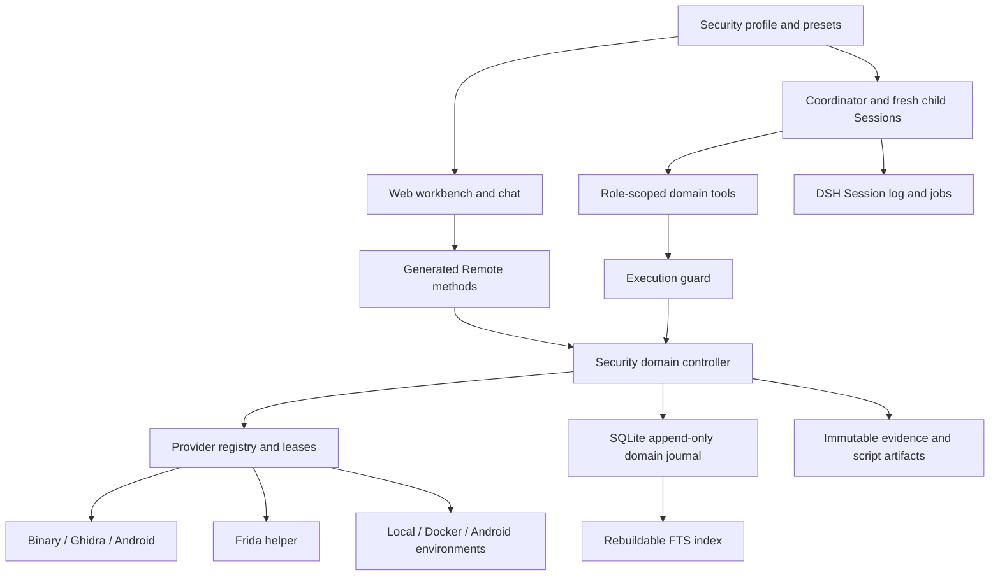

# Security Agent architecture

English | [中文](security-architecture.zh.md)

> [!IMPORTANT]
>
> This is an experimental extension. The [feature TODO](roadmaps/security-analysis.md) tracks incomplete work. A successful tool call or a generated report does not establish a verified vulnerability.

## Contents

- [Composition](#composition)
- [Checks and evidence](#checks-and-evidence)
- [Roles and authority](#roles-and-authority)
- [Execution and recovery](#execution-and-recovery)
- [Extension points](#extension-points)

## Composition

The security profile adds plugins to the existing DSH Host, Session and Web application. `pnpm security` selects that profile and defaults to port 3081; the ordinary Web profile defaults to 3080. The [user guide](user/guide/security-analysis.md) owns setup and environment configuration. The agent loop remains unchanged.

| Module | Responsibility | Implementation |
|---|---|---|
| Security domain | Projects, identities, checks, permissions, evidence, plans and knowledge | [security-analysis](../packages/experimental/security-analysis/README.md) |
| Providers | Tool capability discovery, environment checks, bounded execution and cleanup | Separate exports of the security-analysis package; they are not separate packages |
| Host profile and presets | Plugin composition, role prompts and restricted tools | [security-profile](../packages/experimental/security-profile/README.md) |
| Web composition | Security preset, workbench registration and distinct default port | [security-web-profile](../packages/experimental/security-web-profile/README.md) |
| Workbench | Project selection, evidence search and operator approval | [client-ui-security-analysis](../packages/experimental/client-ui-security-analysis/README.md) |

## Checks and evidence

Each asset follows reconnaissance → surface analysis → assessment → controlled validation. Check dependencies, attempts, completion evidence and interruption status are domain records. Project completion cannot be inferred from one successful observation. Reopening a check records a reason.

Raw artifacts are persisted before their evidence references. Evidence links observations to the sample identity, tool invocation and completeness state; hypotheses and knowledge remain distinct records. SQLite stores append-only commands with operation IDs and expected revisions. The FTS index is derived and rebuildable. The [domain API reference](subsystems/security-workbench.md) owns record and Remote details.

The Session log stores model interaction and tool results. The domain journal stores project state; jobs represent live work. They have different recovery responsibilities. Knowledge proposals remain local until an operator publishes them. Shared experience is reference material, not evidence collected from the current sample.

## Roles and authority

| Role | Assigned work | Tool authority |
|---|---|---|
| Coordinator | Decompose checks, delegate and assemble conclusions | Domain commands, observations, jobs and execution of approved plans |
| Reconnaissance | Inventory one assigned asset | Binary observations and restricted Ghidra/Android inventory |
| Reverse analyst | Examine entry points and weakness hypotheses | Approved static query operations, including decompilation |
| Researcher | Retrieve project evidence and public references | Evidence retrieval and Web research; no provider execution |
| Reviewer | Check supporting and opposing evidence | Read existing evidence and return a structured assessment |

Roles are bound to a project, Session and allowed assets. Children use fresh Sessions and return a summary, evidence references, uncertainty and next steps. Detailed interaction remains in the child Session. [Role/tool assignments and task prompts](../packages/experimental/security-analysis/src/workbench/roles.ts) define the current fixed roles; configurable role registration is future work.

Tool restrictions and `tools.guard()` complement checks at the domain execution entry. Children cannot approve plans, change environments or delegate again. The security composition disables general shell and PTC entry points; hidden tool cards alone are not authorization. Driver-owned `structured_output` is admitted in the child scope without adding it to the inherited-tool restriction list.

## Execution and recovery

Validation requires an immutable plan describing target, operation, script, expected observation, impact, duration and cleanup. The operator approves its version through the workbench. Execution checks approval freshness and target identity; changed scripts or scope require another plan. Revocation and project stop prevent new work and cancel active execution.

Ghidra queries require an explicitly bound program and managed authentication patch. Frida uses an independent Python helper with identity checks, structured events and cleanup. Arbitrary script text cannot establish read-only behavior. Tool presence does not establish environment readiness; the package reference maintains the actual compatibility limits.

After restart, unfinished execution requires reconciliation rather than automatic replay of injection or process creation. Leases serialize conflicting resources. Per-operation time/output limits and child concurrency bounds exist; a project-wide cumulative delegation/token budget remains a TODO. Complete crash recovery and raw-output retention under all failure paths still require acceptance testing.

## Extension points

Future Web and IoT projects should add asset/check definitions, provider operations, environment requirements, role policies, prompts and evidence consumers together. An execution adapter alone is insufficient. Keep Host credentials and environment management outside the analyzed target. Reuse DSH Session, jobs, subprocess, storage and Remote services instead of changing the loop.

Start with the [feature TODO](roadmaps/security-analysis.md). ELF/PE structured parsing, real Ghidra binding and reliable review are the next priorities; Web/IoT expansion follows a working reverse-analysis baseline.
