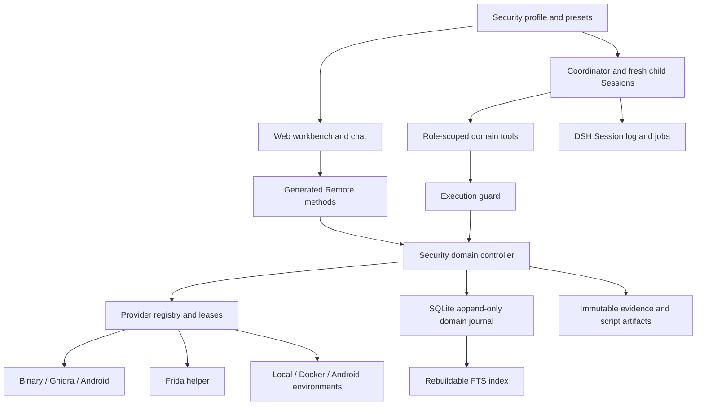

# 安全 Agent 架构

[English](security-architecture.md) | 中文

> [!IMPORTANT]
>
> 当前为实验性扩展。[功能 TODO](roadmaps/security-analysis.zh.md)记录尚未完成的工作。工具调用成功或生成报告不能证明漏洞已被验证。

## 目录

- [模块组合](#composition)
- [检查与证据](#checks-and-evidence)
- [角色与权限](#roles-and-authority)
- [执行与恢复](#execution-and-recovery)
- [扩展位置](#extension-points)

## 模块组合

安全 profile 在现有 DSH Host、Session 和 Web 应用上组合插件。`pnpm security` 选择该 profile，默认端口为 3081；通用 Web profile 默认端口为 3080。[使用指南](user/guide/security-analysis.zh.md)维护启动和环境配置方式。agent-loop 保持不变。

| 模块 | 职责 | 实现位置 |
|---|---|---|
| 安全领域 | 项目、身份、检查、权限、证据、计划与知识 | [security-analysis](../packages/experimental/security-analysis/README.zh.md) |
| Providers | 工具能力发现、环境检查、有界执行与清理 | security-analysis 包的独立导出，目前不是独立包 |
| Host profile 与 presets | 插件组合、角色提示词与工具限制 | [security-profile](../packages/experimental/security-profile/README.zh.md) |
| Web 组合 | 安全 preset、工作台注册与独立默认端口 | [security-web-profile](../packages/experimental/security-web-profile/README.zh.md) |
| 工作台 | 项目选择、证据检索与操作者批准 | [client-ui-security-analysis](../packages/experimental/client-ui-security-analysis/README.zh.md) |

## 检查与证据

每个资产按侦察 → 攻击面分析 → 漏洞评估 → 受控安全验证推进。检查依赖、尝试次数、完成证据及中断状态保存在领域记录中。一条观察成功不能代表项目完成；重新打开检查需要记录原因。

先持久化原始制品，再提交证据引用。证据将观察与样本身份、工具调用和完整性状态关联；假设与知识分别保存。SQLite 以操作标识和预期修订号追加命令记录；FTS 索引可从记录重建。[领域 API 参考](subsystems/security-workbench.zh.md)维护记录及 Remote 细节。

Session 日志保存模型交互和工具结果；领域日志保存项目状态；jobs 表示运行中的任务，它们的恢复职责不同。知识候选在操作者发布前保持本地状态。共享经验属于参考材料，不是从当前样本采集的证据。

## 角色与权限

| 角色 | 分配任务 | 工具权限 |
|---|---|---|
| 协调者 | 分解检查、委派任务、汇总结论 | 领域命令、观察、jobs 及已批准计划的执行 |
| 侦察者 | 清点一个明确分配的资产 | 二进制观察及受限的 Ghidra/Android 清点 |
| 逆向分析员 | 分析入口与弱点假设 | 允许的静态查询操作，包括反编译 |
| 研究员 | 检索项目证据与公开资料 | 证据检索和 Web 研究，不执行 provider |
| 复核者 | 核对支持与反对证据 | 读取已有证据，返回结构化评估 |

角色绑定到项目、Session 和允许的资产。子 agent 使用 fresh Session，返回摘要、证据引用、不确定性及下一步；详细交互保留在子 Session。[角色工具分配与任务提示词](../packages/experimental/security-analysis/src/workbench/roles.ts)定义当前固定角色；可配置角色注册仍属后续工作。

工具限制与 `tools.guard()` 配合领域执行入口检查。子 agent 不能批准计划、改变环境或继续委派。安全组合关闭通用 shell 和 PTC 入口；仅隐藏工具卡片不构成授权控制。驱动拥有的 `structured_output` 在子作用域中放行，不加入继承工具限制名单。

## 执行与恢复

验证必须具备不可变计划，描述目标、操作、脚本、预期观察、影响、时限与清理。操作者通过工作台批准该版本。执行时核对批准有效期及目标身份；脚本或范围变化需要另建计划。撤销授权和停止项目会阻止新动作并取消活动执行。

Ghidra 查询需要明确绑定程序及受管理认证补丁。Frida 使用独立 Python helper，执行身份核对、结构化事件采集与清理。任意脚本文本不能证明操作只读；工具存在也不代表环境就绪，实际兼容限制由包参考维护。

重启后未结算执行需要核对，不能自动重放注入或进程创建。租约将冲突资源串行化。已有单操作耗时/输出限制和子 agent 并发上限；项目累计委派次数及 token 预算仍为 TODO。完整崩溃恢复与所有失败路径下的原始输出保留仍需验收。

## 扩展位置

后续 Web、IoT 项目应同时增加资产/检查定义、provider 操作、环境要求、角色策略、提示词和证据消费入口；仅增加执行适配器不足以形成完整能力。Host 凭据和环境管理应留在分析目标之外。复用 DSH Session、jobs、subprocess、storage 与 Remote 服务，避免修改 agent-loop。

下一步见 [功能 TODO](roadmaps/security-analysis.zh.md)。优先补齐 ELF/PE 结构化解析、真实 Ghidra 绑定与可靠复核；逆向分析基础闭环之后再扩展 Web/IoT。
